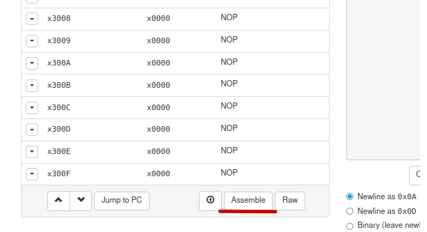
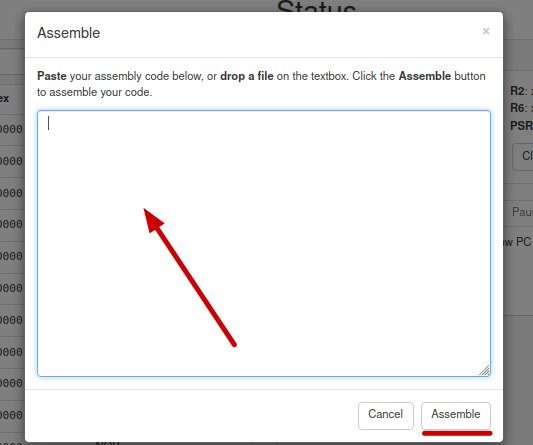
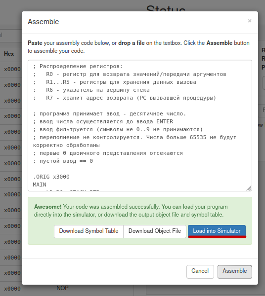
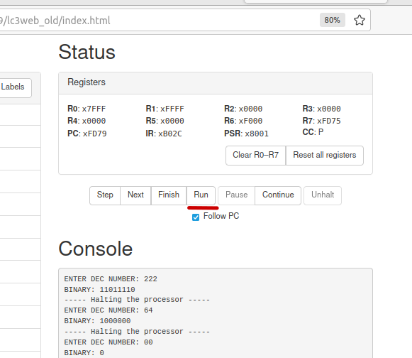

# INTRO TO COMPUTER SIENCE 2

### Ссылка на эмулятор
[LC-3](https://courses.grainger.illinois.edu/ece220/fa2019/lc3web_old/index.html)

Данный эмулятор поддерживает более полный набор векторов "системнх вызовов", чем предложенный в условии задач.

##### Запуск программы в эмуляторе

Для загрузки программы в эмулятор необходимо:  

1. Нажать кнопку **Assemble**. Откроется окно для ввода программы.

2. Скопировать исходный код или перенести текстовый файл в выделенную область и нажать кнопку **Assemble**.

3. При успешной "сборке" симулятор предложит загрузить программу в симулятор. Необходимо нажать кнопку **Load into Simulator**  

4. Для запуска загруженной программы необходимо нажать кнопку **Run**.

##### Дополнительные указания

 - Для перезапуска программы необходимо вывести программу из приостановленного состояния (кнопка **Unhalt**), сбросить состояние регистров (кнопка **Reset all registers**) и снова нажать запуск программы (кнопка **Run**).
 - Для ввода данных в программу, необходимо, чтобы область консоли (**Console**) была в фокусе.

### Задача 1

Вывод символов двоичного числа в обратном порядке. Например:

> 10001001 ➡️ 10010001

**Файлы с решением:**
    - reverse_bin.asm
    - reverse_bin_v2.asm

##### Комментарии к решению reverse_bin.asm

 - **reverse_bin.asm** использует наиболее примитивный подход к решению задачи - читает пользовательский ввод и сохраняет его во внутреннем буфере.  
 Ввод читается до того момента, пока пользователь не введет LF или не закончиться внутренний буфер. Далее программа выводит введенные символы в обратном порядке.
  - Такое решение явно разворачивает любую строку, а не только двоичное число.
  - Дополнительные данные о деталях решения задачи приведены в файле исходного кода **reverse_bin.asm**

##### Запуск программы reverse_bin.asm

 - после нажатия кнопки **Run** в поле **Console** будет выведено приглашение на ввод:

> ENTER BINARY VALUE: 

 - после ввода двоичного числа (и не только двоичного числа xD) и нажатия ENTER будет выведен результат разворота строки и сообщение об остановке процессора:

 > ENTER BINARY VALUE: 1011
REVERSED: 1101
----- Halting the processor ----- 

##### Изменене параметров запуска reverse_bin.asm

 - Для изменения размера максимальной длины вводимой строки необходимо изменить значения длины буфера `STR_LEN` и саму длину буфера `STR_BUF_PTR`

 ##### Комментарии к решению reverse_bin_v2.asm

 - **reverse_bin_v2.asm** для решения вводит примитивный стек. Стек используется для сохранения состояния рабочих регистров при вызове процедур (инструкция `JSR`).
 - Стекинг - зона ответственности вызванной процедуры.
 - Во время стекинга сохраняется состояние регистров R1 - R5. R0 - регистр для передачи параметров и возврата значения, R6 - вершина стека, R7 - ядрес возврата при завершении процедуры.
 - Примитивный стек позволяет более полноценно организовывать структурирование кода и вводить "функции".
 - В данной задаче введена функция `READ_0_OR_1` которая фильтрует пользовательский ввод и позволяет вводить только 0 или 1.
 - В остальном решение соответсвтует **reverse_bin.asm**
 - Дополнительные данные о деталях решения задачи приведены в файле исходного кода **reverse_bin_v2.asm**

##### Запуск программы reverse_bin_v2.asm

 - после нажатия кнопки **Run** в поле **Console** будет выведено приглашение на ввод:

> ENTER BINARY VALUE: 

 - после ввода двоичного числа и нажатия ENTER будет выведен результат разворота строки и сообщение об остановке процессора:

 > ENTER BINARY VALUE: 1011
REVERSED: 1101
----- Halting the processor ----- 

##### Изменене параметров запуска reverse_bin_v2.asm

 - Для изменения размера максимальной длины вводимой строки необходимо изменить значения длины буфера `STR_LEN` и саму длину буфера `STR_BUF_PTR`

### Задача 2

Перевод числа из десятичной системе счисления в двоичную. Например:

> 137 ➡️ 10001001

##### Комментарий к задаче:

Это требует реализации операции DIV, сохранения остатков от деления итд.

### Задача 3

Вывести двоичное написание числа в обратном порядке. Например:

> 137 ➡️ 10001001 ➡️ 10010001

##### Комментарий к задаче:

Это комбинация задач 1 и 2. Число вводится в десятичной системе счисления, необходимо преобразовать его в двоичную запись, и затем вывести в обратном порядке.

### Задача 4

Реализовать вывод чисел Fibonacci до данного порядкого номера (F0 -> 0, F1 -> 1, 1, 2, 3, 5, 8, 13, 21, 34, 55, 89, 144, 233).

