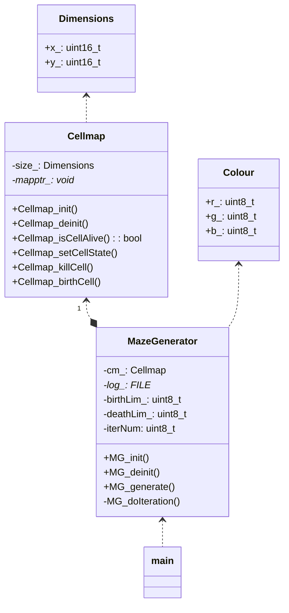
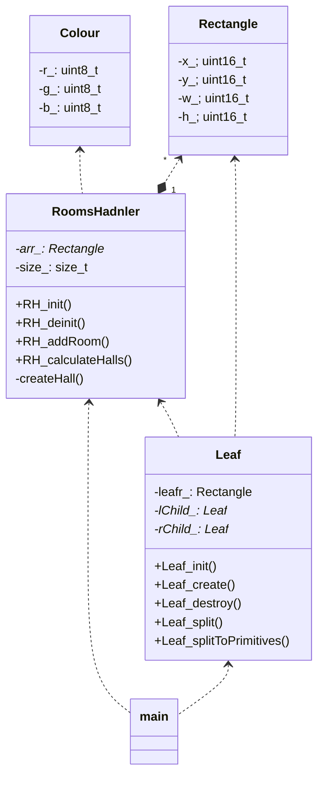
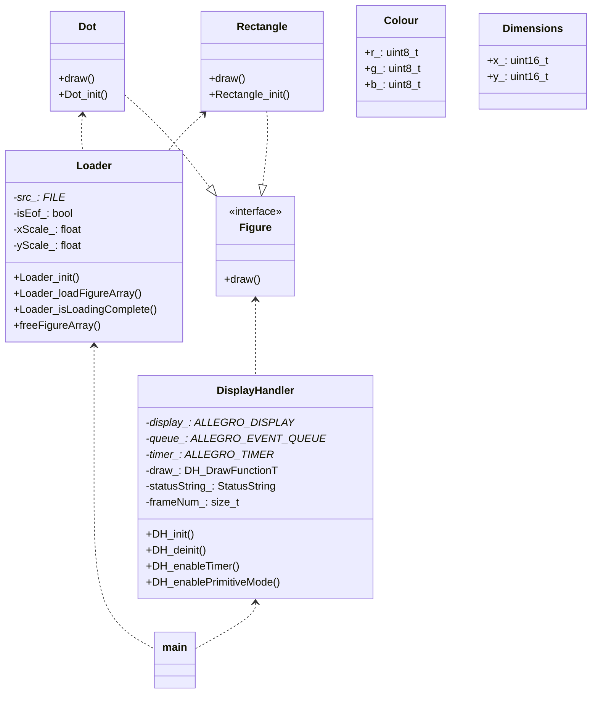

# OPERATIONAL SYSTEMS 2

### Задача «построение лабиринта»

Написать программу генерации лабиринта на языке C. Метод генерации лабиринта - любой.

### Решение

Решение состоит из нескольких отдельных программ и осущетсвляет построение лабиринтов 2мя методами:  

1. методом клеточных автоматов
2. методом BSP разделения

Части решения (программы):

1. cellular_automata_maze - строит лабиринт методом клеточных автоматов и выдает (в стандартный поток вывода) описание данного лабиринта в виде перечня графических примитивов.
2. bsp_maze - строит лабиринт методом bsp разделения и выдает описание данного лабиринта в виде перечня графических примитивов.
3. maze_viewer - принимает из стандартного потока ввода описание лабинта и выводит его.

Ниже приведены примеры с демонстрацией работы программ.

<p align="center">
  
  
</p>

<p align="center">
  
</p>

### cellular_automata_maze

Программа осуществляет построение лабиринта методом клеточных вытоматов. Описание алгоритма привелено по ссылке:  
[Generate Random Cave Levels Using Cellular Automata](https://gamedevelopment.tutsplus.com/generate-random-cave-levels-using-cellular-automata--gamedev-9664t)

**Файл с решением:** cellular_automata_maze.c  

**сборка решения**  
Текущий рабочий каталог для исполнения команд должен располагаться в корневом каталоге проекта.  

```shell
make cellular_automata_maze
```

**аргументы командной строки**

```shell
Options
usage ./cellular_automata_maze [-r <field_size>] [-l <life_chance>] [-n <iter_num>] [-b <birth_lev>] [-d <death_lev>]
    -r <field_size>         задание размера поля с клетками, filed_size - строка вида wxh
    -l <life_chance>        вероятность начать жизнь в клетке, life_chance - число с плавающей точкой в диапазоне 0 ... 1
    -n <iter_num>           количество итераций в расчете лабиринта, iter_num - челое число
    -b <birth_lev>          количество живых клеток-соседей, для рождения клетки, birth_lev - целое число
    -d <death_lev>          количество живых клеток-соседей, для смерти клетки death_lev - целое число
```

**UML диаграмма классов**



### bsp_maze

Программа осуществляет построение лабиринта методом BSP деления поля. Описание алгоритма приведено по ссылке:  
[How to Use BSP Trees to Generate Game Maps](https://gamedevelopment.tutsplus.com/how-to-use-bsp-trees-to-generate-game-maps--gamedev-12268t)

**Файл с решением:** bsp_maze.c  

**сборка решения**  
Текущий рабочий каталог для исполнения команд должен располагаться в корневом каталоге проекта.  

```shell
make bsp_maze
```

**UML диаграмма классов**



**Комментарий**: BSP не обеспечивает аккуратного соединения сгенерированных комнат. Коридоры могут пересекать все поле образуя дублирующие пути и слияния с другими комнатами.

### maze_viewer

Программа осуществляет построение лабиринтов по описанию, которое генерируют программы cellular_automata_maze и bsp_maze. Программа использует игровой движок Allegro. Для последовательного перелистывания кадров с построением можно использовать нажатие клавиши (любой) и/или таймер.

**Файл с решением:** maze_viewer.c  

**Зависимости:** игрвой движок аллегро  
[указания по установке и сборке для разных платформ](https://gamedevelopment.tutsplus.com/how-to-use-bsp-trees-to-generate-game-maps--gamedev-12268t)

**сборка решения**  
Текущий рабочий каталог для исполнения команд должен располагаться в корневом каталоге проекта.  

```shell
make maze_viewer
```

**аргументы командной строки**

```shell
Options
usage ./maze_viewer [-r <resolution>] [-t <time>] [-d]
    -r <resolution>         задание разрешения изображения, resolution - строка вида wxh
    -t <time>               включить таймер для перемотки примитивов, time - время срабатывания таймера в секундах
    -d                      включить построение лабиринта по примитивам (клавиша будет отображать очередной примитив, а не кадр)
```

**UML диаграмма классов**



### демонстрация

```bash
    make ca_diff_ssize_demo # демонстрация лабиринта на клеточных автоматах. Перемотка построения по таймеру.
    make ca_midsize_demo    # демонстрация лабиринта на клеточных автоматах. Перемотка построения по нажатию клавиши.
    make ca_hres_demo       # демонстрация лабиринта на клеточных автоматах. Перемотка построения по таймеру. Высокое разрешение
    make bsp_demo           # демонстрация лабиринта построенного bsp делением. Перемотка по таймеру.
```
