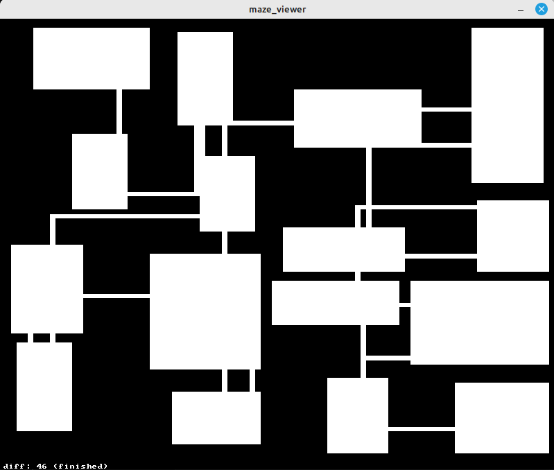

структура:
3. описание модулй cellular automata.
ссылка на оригинал алгоритма 
указание на проектные файлы
зависимости
команда для билда
аргументы командной строки
uml идаграмма

4. аналогично для bsp (+ комментарий о том, что алгоритм  соединения плохой)

5. аналогично для viewer (делает скейлинг)

6. запуск демонстраций и комментарии

# OPERATIONAL SYSTEMS 2

### Задача «построение лабиринта»

Написать программу генерации лабиринта на языке C. Метод генерации лабиринта - любой.

### Решение

Решение состоит из нескольких отдельных программ и осущетсвляет построение лабиринтов 2мя методами:  

1. методом клеточных автоматов
2. методом BSP разделения

Части решения:

1. cellular_automata_maze - строит лабиринт методом клеточных автоматов и выдает (в стандартный поток вывода) описание данного лабиринта в виде перечня графических примитивов.
2. bsp_maze - строит лабиринт методом bsp разделения и выдает описание данного лабиринта в виде перечня графических примитивов.
3. maze_viewer - принимает из стандартного потока ввода описание лабинта и выводит его.

Ниже приведены примеры с демонстрацией работы программ.

<p align="center">
  
  
</p>

<p align="center">
  
</p>

### cellular_automata_maze

Программа осуществляет построение лабиринта методом клеточных вытоматов. Описание алгоритма привелено по ссылке:  
[Generate Random Cave Levels Using Cellular Automata](https://gamedevelopment.tutsplus.com/generate-random-cave-levels-using-cellular-automata--gamedev-9664t)

**Файл с решением:** cellular_automata_maze.c  

**сборка решения**  
Текущий рабочий каталог для исполнения команд должен располагаться в корневом каталоге проекта.  
Сборка программы:  

```shell
make cellular_automata_maze
```

**аргументы командной строки**

```shell
Options
usage cellular_maze_automata [-r <filed_size>] [-l <life_chance>] [-n <iter_num>] [-b <birth_lev>] [-d <death_lev>]
    -r <filed_size>         задание размера поля с клетками, filed_size - строка вида wxh
    -l <life_chance>        вероятность начать жизнь в клетке, life_chance - число с плавающей точкой в диапазоне 0 ... 1
    -n <iter_num>           количество итераций в расчете лабиринта, iter_num - челое число
    -b <birth_lev>          количество живых клеток-соседей, для рождения клетки, birth_lev - целое число
    -d <death_lev>          количество живых клеток-соседей, для смерти клетки death_lev - целое число
```

**UML диаграмма классов**


### bsp_maze


### maze_viewer


